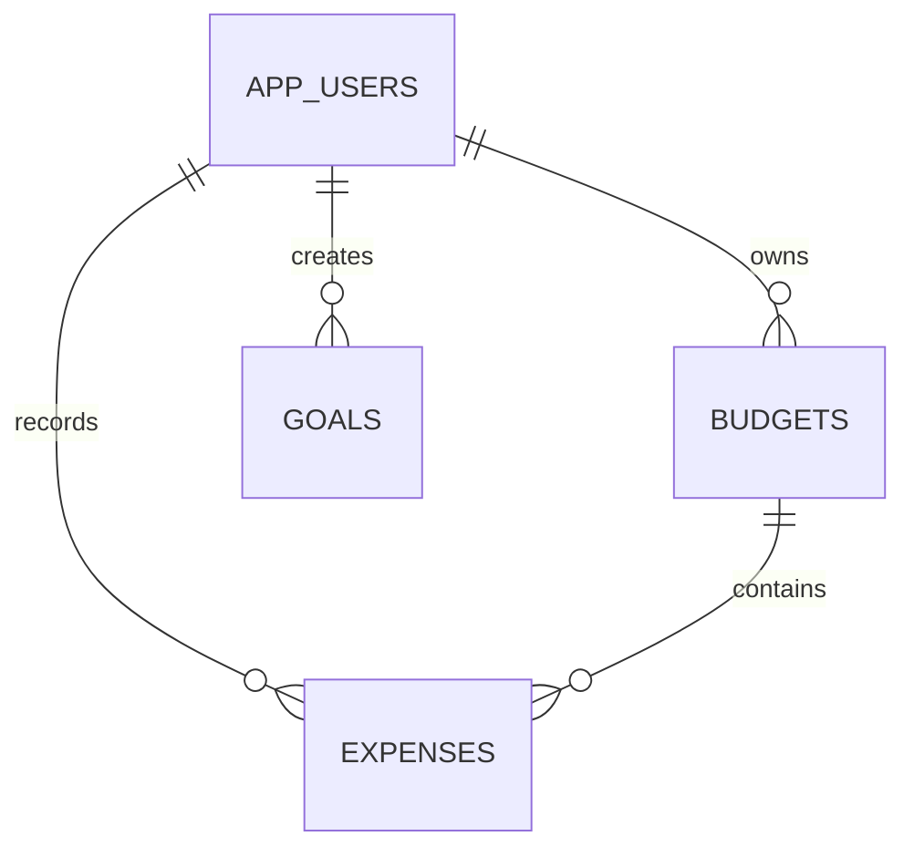

# Database Design

BudgetBrain uses PostgreSQL. Spring Data JPA repositories provide persistence and Hibernate manages the schema from the entity definitions in `spring-backend/src/main/java/com/budgetbrain/model/`.

## Tables

| Table | Primary data |
|---|---|
| `app_users` | Account name, unique email, BCrypt password hash, avatar |
| `budgets` | User foreign key, name, amount, currency, color |
| `expenses` | User and budget foreign keys, name, amount, category, optional receipt image |
| `goals` | User foreign key, target, saved amount, deadline, icon |

Amounts use `numeric(14,2)`. Timestamps use UTC instants. Receipt images use PostgreSQL `bytea` together with a stored content type. User and creation-time indexes support the authenticated, newest-first list queries used throughout the application.

All resource repositories expose ownership-scoped lookups such as `findByIdAndUserId`. Budget deletion removes related expenses transactionally before deleting the budget.
