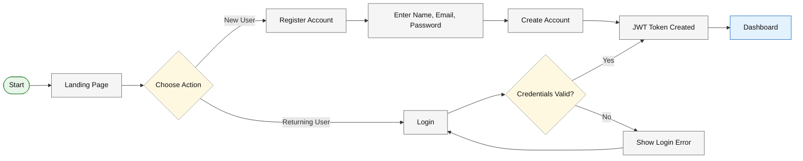
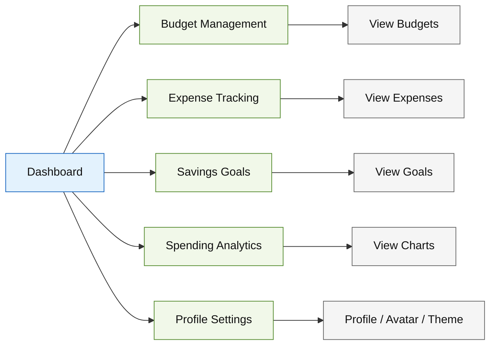
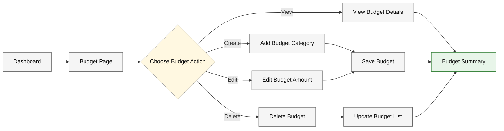
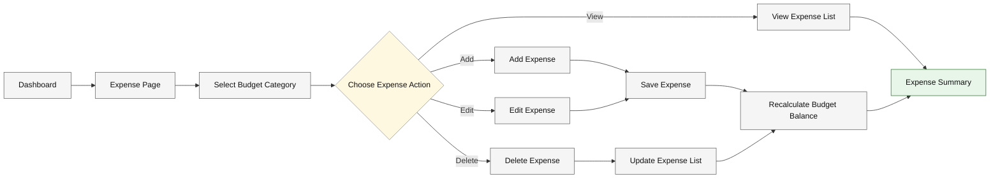
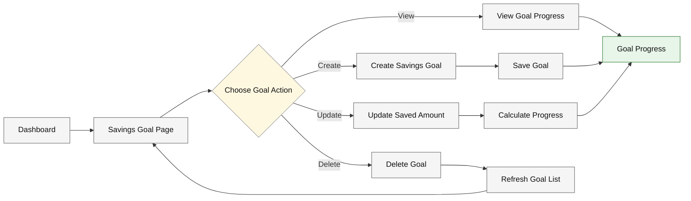
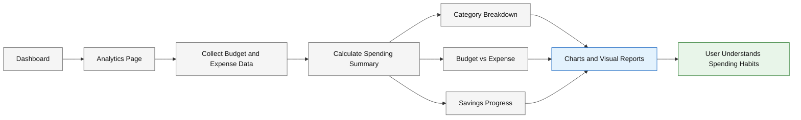
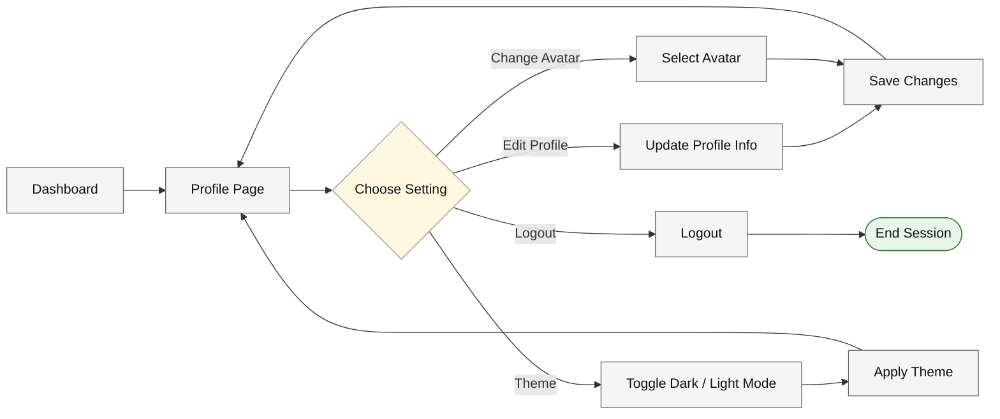
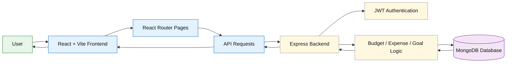

# BudgetBrain — Conceptual User Flow Diagrams

This document explains the main user flow of the BudgetBrain project in a clear section-wise structure.

BudgetBrain helps users manage personal finance by tracking budgets, expenses, savings goals, and analytics.

---

## 1. Authentication Flow

This diagram shows how users register, log in, and enter the app.

---

## 2. Main Dashboard Flow

This diagram shows the main areas users can access after logging in.

---

## 3. Budget Management Flow

This diagram shows how users create and manage budgets by category.

---

## 4. Expense Tracking Flow

This diagram shows how users add and manage expenses inside their budgets.

---

## 5. Savings Goal Flow

This diagram shows how users create savings goals and track progress.

---

## 6. Analytics Flow

This diagram shows how BudgetBrain turns user data into spending insights.

---

## 7. Profile and Theme Flow

This diagram shows how users manage their profile, avatar, and theme preference.

---

## 8. Backend and Data Flow

This diagram shows how the frontend communicates with the backend and database.

---

## Summary

| Section | Purpose |
|---|---|
| Authentication Flow | Shows how users register and log in |
| Main Dashboard Flow | Shows the main app areas after login |
| Budget Management Flow | Shows how users create, edit, delete, and view budgets |
| Expense Tracking Flow | Shows how users manage expenses inside budgets |
| Savings Goal Flow | Shows how users create and track savings goals |
| Analytics Flow | Shows how user data becomes charts and insights |
| Profile and Theme Flow | Shows profile, avatar, theme, and logout options |
| Backend and Data Flow | Shows frontend, backend, authentication, and database connection |

---

_Last updated: May 2026_
